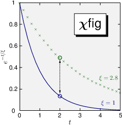
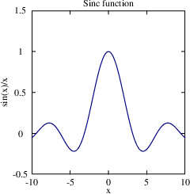
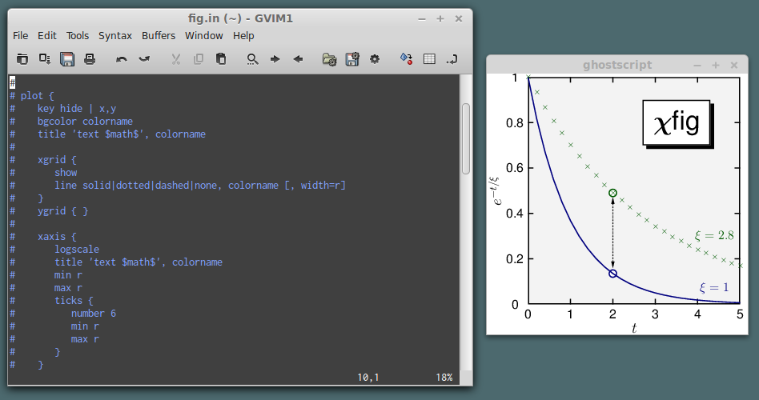

## Introduction
**chifig** is a Ruby program that reads an input specification of a figure,
consisting of one or more 2D (x,y) plots, and creates a publication quality 
Postscript representation of the figure.  The input specification can be either 
JSON, created by any other program, or a domain-specific minilanguage (DSL) 
that is much more concise than JSON.

**chifig** can read data from text files or generate data from mathematical 
expressions.  Every feature of a figure can be customized, but **chifig** 
provides sensible default values for most features, so figures can be generated 
quickly, without adjusting too many settings.

## Requirements
In addition to Ruby, **chifig** uses latex and dvips to generate figures.
It relies on the following latex packages:

* pstricks
* pst-plot
* standalone

In Ubuntu, these requirements are fulfilled by installing the following 
packages:

* texlive
* texlive-pstricks
* texlive-latex-extra

Most TeX distributions (such as TeX Live) provide latex, these packages, and 
dvips.

The installation process requires Rake (see below).

## Example

    # 
    # A simple DSL example: plot the sinc function
    # 
    plot {
       title 'Sinc function'
       key hide
       xaxis {title 'x'}
       yaxis {
          title 'sin(x)/x'
          min -0.5
          max 1.5
       }
       curve {
          generate 'sin(x)/x', -10, 10, 0.2
          line solid, blue
          symbol none
       }
    }
See the equivalent JSON input of this example [here](doc/examples/sinc.json).

## Installation
All installation options are defined in the file install\_config.rb in the 
top source directory.  To see the current configuration, use this command:

    rake show_config

Edit install\_config.rb to customize any installation paths, then type

    (sudo) rake install

This command may require elevated privileges (sudo) to install to system
directories.

## Usage
After installing all components (see above), invoke *chifig* from the command
line with the following command:

    chifig  infile  psfile

where *infile* may be a JSON file or a DSL file.

### chide
*chide* is an interactive development environment for figures generated with
the *chifig* DSL.  *chide* launches your favorite editor and Ghostscript.
As you edit and save a DSL input file in the editor, the Ghostscript window 
will display the resulting Postscript.

Invoke *chide* from the command line with this command:

    chide [infile] [psfile] [width] [height]

The optional arguments include the input file (default: figure.in), the output
Postscript file (default: figure.ps), the Ghostscript window width and height 
(default: 245).

